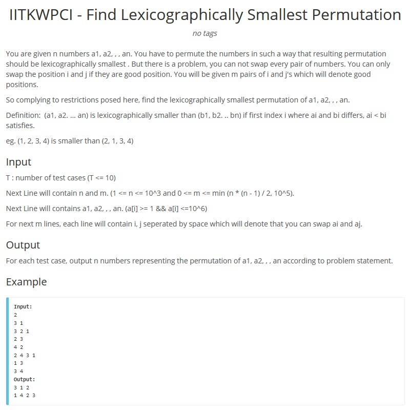

Temas:

- Grafos2

# Grafos2_MST_Anoes

**Conteúdo da Disciplina**: Grafos 2

## Alunos

| Matrícula  | Aluno                            |
| ---------- | -------------------------------- |
| 18/0054082 | Marcelo Victor de Sousa Silva    |
| 18/0029223 | Washington Bispo Arishita Junior |

## Sobre

O projeto consiste na resolução de exercicios de competição voltados aos conteudos estudados no módulo de grafos 2

## Screenshots





## Instalação

**Linguagem**: C++ 17

## Uso

Para rodar as questões pode ser utilizado um compilador online de c++.

Como por exemplo o do site: <https://www.onlinegdb.com/online_c++_compiler>

## Apresentação

O link da apresentação pode ser encontrado no seguinte link:

<https://youtu.be/P9JtuwhE6YY>

e também na pasta raiz com o nome:

```
./apresentacao.mp4
```
